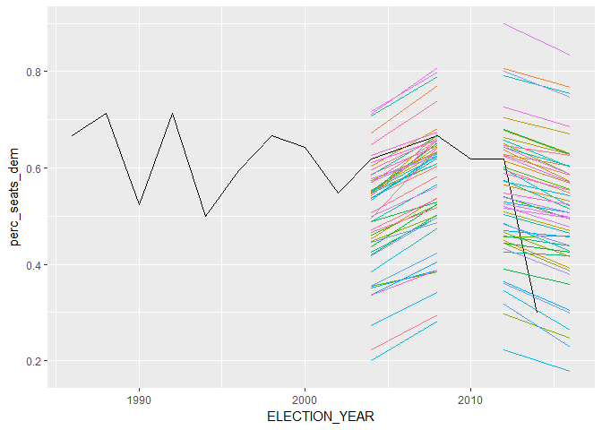

Final Project Visualization
================
Thao Dinh and Ben Black
April 18, 2017

``` r
library(foreign)
library(tidyverse)
```

    ## Loading tidyverse: ggplot2
    ## Loading tidyverse: tibble
    ## Loading tidyverse: tidyr
    ## Loading tidyverse: readr
    ## Loading tidyverse: purrr
    ## Loading tidyverse: dplyr

    ## Conflicts with tidy packages ----------------------------------------------

    ## filter(): dplyr, stats
    ## lag():    dplyr, stats

``` r
library(lubridate)
```

    ## 
    ## Attaching package: 'lubridate'

    ## The following object is masked from 'package:base':
    ## 
    ##     date

``` r
library(ggplot2)
library(gtable)
library(grid)
```

``` r
IN_SENATE = function(sen_or_house) sen_or_house == 8
IN_HOUSE = function(sen_or_house) sen_or_house == 9
DEM_PARTY_CODE = 100
REP_PARTY_CODE = 200
is_dem = function(code) ifelse(code=="DEM",1,0)
```

``` r
data = read.dta("state-legislative-data/SLERs1967to2015_20160912b_NV.dta")
```

``` r
tables = lapply(data,function(x)table(x,useNA="ifany"))
info_densty = lapply(tables,dim)
tables["v09z"]
```

    ## $v09z
    ## x
    ##    1    2    3    4    5    6    7    8    9   10   11   12   13   14   15 
    ##  207  130  176  129  106   74   84   80   68   66   50   58   60   67   57 
    ##   16   17   18   19   20   21   22   23   24   25   26   27   28   29   30 
    ##   58   55   47   55   55   57   53   40   50   41   55   54   47   51   52 
    ##   31   32   33   34   35   36   37   38   39   40   41   42 <NA> 
    ##   49   73   39   43   42   48   47   53   52   57   43   37  102

``` r
named_data = data %>%
  rename(ELECTION_YEAR=v05,
         ELECTION_MONTH=v06,
         ELECTION_DAY=v06b,
         SENATE_OR_HOUSE=v07,
         DISTRICT_NAME=v08,
         ALT_DISTRICT_NAME=v08z,
         DISTRICT_NUM=v09,
         ALT_DISTRICT_NUM=v09z,
         DISTRICT_TYPE=v12,
         NUM_WINNERS_FOR_POS=v13,
         TERM_LENGTH_BY_LAW=v14,
         TERM_LENGTH_ACTUAL=v15,
         ELECTION_TYPE=v16,
         ELECTION_DETERMINES_SITTING_LEG=v17,
         ELECTION_DETERMINES_SITTING_LEG_GEN=v17b,
         CANIDATE_ID=v18,
         PARTY_CODE_DETAILED=v20,
         PARTY_CODE_SIMPLIFIED=v21,
         INCUMBENCY_DUMMY=v22,
         CANIDATE_VOTE_TOTAL=v23,
         ELECTION_WINNER=v24) %>%
  mutate(party_code = ifelse(PARTY_CODE_SIMPLIFIED == DEM_PARTY_CODE,"DEM",
                           ifelse(PARTY_CODE_SIMPLIFIED == REP_PARTY_CODE,"REP",
                                                                           "OTHER")),
         DistrictId = paste(ifelse(is.na(DISTRICT_NAME),"",DISTRICT_NAME),
                            ifelse(is.na(DISTRICT_NUM),1,DISTRICT_NUM),sep=""))

#table(named_data$DistrictId)

general_election_data = named_data %>%
  filter(ELECTION_DETERMINES_SITTING_LEG==1)

house_data = filter(general_election_data,IN_HOUSE(SENATE_OR_HOUSE))
senate_data = filter(general_election_data,IN_SENATE(SENATE_OR_HOUSE))

#table(senate_data$DISTRICT_TYPE)
#table(senate_data$DISTRICT_NAME,senate_data$DISTRICT_NUM,useNA="ifany")
#table(house_data$election_full_date)
#table(named_data$SENATE_OR_HOUSE,useNA="ifany")
```

Plot Trends between Nevada's Economic Conditions and Legislative Election's Results
===================================================================================

``` r
#Import Nevada Data on % Change of Annual Median Household Income (Marginal) 1984-2016
MedianIncomeData_Nevada = read_csv("state-legislative-data/Economic Data/Nevada Percent Change in Annual Real Median Househod Income Data 1984-2016.csv") %>%
  rename(MHI_Change_LOCAL = MEHOINUSNVA672N_PCH) %>%
  mutate(YEAR = as.integer(format(DATE,"%Y")))
```

    ## Parsed with column specification:
    ## cols(
    ##   DATE = col_date(format = ""),
    ##   MEHOINUSNVA672N_PCH = col_double()
    ## )

``` r
#Import Nevada's Annual Unemployment Rate Data 1976-2016 
Unemployment_Nevada <- read_csv("state-legislative-data/Economic data/Nevada Annual Unemployment Rate 1976-2016.csv") %>% 
  rename(Unemployment_LOCAL = NVUR) %>%
  mutate(YEAR = as.integer(format(DATE,"%Y")))
```

    ## Parsed with column specification:
    ## cols(
    ##   DATE = col_date(format = ""),
    ##   NVUR = col_double()
    ## )

``` r
#Join the Previous 4 Data Fragments Together into one Frame  (labeled Economic Data)
economic_data <- Unemployment_Nevada %>%
  left_join(MedianIncomeData_Nevada, by=c("YEAR" = "YEAR")) %>%
  select(3, 2, 5)
```

``` r
use_dataECON = general_election_data %>%
  select(ELECTION_WINNER,
         ELECTION_YEAR,
         SENATE_OR_HOUSE,
         party_code,
         INCUMBENCY_DUMMY,
         CANIDATE_VOTE_TOTAL,
         DISTRICT_NUM,
         DistrictId) %>%
  filter(ELECTION_WINNER==1,
         IN_HOUSE(SENATE_OR_HOUSE)) %>%
  group_by(ELECTION_YEAR, SENATE_OR_HOUSE) %>%
  summarize(perc_seats_dem = sum(is_dem(party_code))/n())

use_dataECON$ELECTION_YEAR <- as.integer(use_dataECON$ELECTION_YEAR)

plot_econ_data = economic_data %>%
  mutate(NextElectYear = (YEAR %/% 2)*2) %>%
  group_by(NextElectYear) %>%
  summarize(twoYearUnemployment_LOCAL = mean(Unemployment_LOCAL),
            twoYearMHI_Change_LOCAL = (1+MHI_Change_LOCAL[1]/100)*MHI_Change_LOCAL[2]+MHI_Change_LOCAL[1])

with_economic = use_dataECON %>%
  full_join(plot_econ_data, by=c("ELECTION_YEAR"="NextElectYear")) %>%
  filter(ELECTION_YEAR >= 1986 & ELECTION_YEAR < 2016)

with_economic_Tidied <- with_economic %>% gather(key = Type, value = Percent, 
                                                 twoYearUnemployment_LOCAL, twoYearMHI_Change_LOCAL, 
                                                 perc_seats_dem)
```

``` r
#Plot visualization of Nevada's economic conditions and perc
#p1 <- ggplot(with_economic_Tidied, aes(x = ELECTION_YEAR, y = Percent, col = Type)) + 
#  geom_line()
#g1

#g2 <-ggplot(with_economic, aes(x=perc_seats_dem, y=MHI_Change_LOCAL)) +
#  geom_jitter(aes(col = ELECTION_YEAR))

p1 = ggplot(with_economic,aes(x=ELECTION_YEAR,y=twoYearMHI_Change_LOCAL)) + 
  geom_line(color="red")+
  theme_bw()

p2 = ggplot(with_economic,aes(x=ELECTION_YEAR,y=perc_seats_dem)) + 
  geom_line(color="blue") + 
  theme_bw() %+replace% 
  theme(panel.background = element_rect(fill = NA))

# extract gtable
g1 <- ggplot_gtable(ggplot_build(p1))
g2 <- ggplot_gtable(ggplot_build(p2))

# overlap the panel of 2nd plot on that of 1st plot
pp <- c(subset(g1$layout, name == "panel", se = t:r))
g <- gtable_add_grob(g1, g2$grobs[[which(g2$layout$name == "panel")]], pp$t, 
    pp$l, pp$b, pp$l)

# axis tweaks
ia <- which(g2$layout$name == "axis-l")
ga <- g2$grobs[[ia]]
ax <- ga$children[[2]]
ax$widths <- rev(ax$widths)
ax$grobs <- rev(ax$grobs)
ax$grobs[[1]]$x <- ax$grobs[[1]]$x - unit(1, "npc") + unit(0.15, "cm")
g <- gtable_add_cols(g, g2$widths[g2$layout[ia, ]$l], length(g$widths) - 1)
g <- gtable_add_grob(g, ax, pp$t, length(g$widths) - 1, pp$b)

# draw it
grid.draw(g)
```


Visualize How an Incumbent Candidate affect Voting Ratio
========================================================

``` r
vote_ratio_data <- general_election_data %>%
    select(ELECTION_WINNER,
         ELECTION_YEAR,
         SENATE_OR_HOUSE,
         party_code,
         INCUMBENCY_DUMMY,
         CANIDATE_VOTE_TOTAL,
         DistrictId) %>%
  group_by(ELECTION_YEAR, SENATE_OR_HOUSE, DistrictId) %>%
  summarise(perc_vote_WINNER = max(CANIDATE_VOTE_TOTAL)/sum(CANIDATE_VOTE_TOTAL),
            incumbent_present = sum(INCUMBENCY_DUMMY),
            incumbent_won = sum(INCUMBENCY_DUMMY * CANIDATE_VOTE_TOTAL) == max(CANIDATE_VOTE_TOTAL)) %>%
  filter(perc_vote_WINNER != 1.00) %>%
  mutate(incumbent_present = ifelse(incumbent_won,"Incumbent Won",
                                    ifelse(incumbent_present >= 1, "Incumbent Lost",
                                    "Open Seat Election")))

#Graph
g3 <- ggplot(vote_ratio_data, aes(perc_vote_WINNER)) +
  geom_density() +
  facet_wrap(~incumbent_present) + 
  xlab("Proportion Vote of Winner") + 
  ggtitle("Vote Captured by Winner in Contested Elections")
g3
```


``` r
source("load_precinct_data.R")
```

``` r
ggplot(with_economic,aes(x=ELECTION_YEAR,y=perc_seats_dem)) +
  geom_line() + 
  geom_line(data=pres_summary,mapping=aes(x=Year,y=percent_dem,col=SEP_DIST_ID)) +
 theme(legend.position="none")
```



``` r
#pres_summary%>%
#  summarize()

#pres_use = vote_ratio_data %>%
#  mutate(ElectionID = paste(DistrictId,
#                            ifelse(IN_HOUSE(SENATE_OR_HOUSE),"HOUSE","SENATE"),
#                            ELECTION_YEAR))

#join_data = pres_summary %>%
#  inner_join(pres_use, by=c("ELECTION_ID" = "ElectionID"))
```
